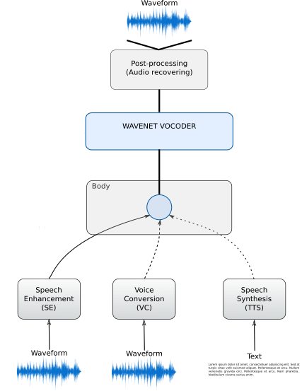

# Deep Multi-Speech model

The aim of this repository is to provide an implementation of what we've called Deep Multi-Speech, a Deep Learning architecture
which generates audio samples for several different tasks such as Speech Enhancement and Voice Conversion, using as a 
vocoder an implementation of Wavenet (https://github.com/r9y9/wavenet_vocoder/).

See https://github.com/ricardokleinklein/deepMultiSpeech/issues/1 for planned TODOs and current progress.

The installation process, as well as the general working scheme follows that of the Wavenet implementation.

## General scheme



## Requirements

- Python 3
- CUDA >= 8.0
- PyTorch >= v0.3
- TensorFlow >= v1.3

## Installation

The repository contains a core library (PyTorch implementation of the WaveNet) and utility scripts. All the library and its dependencies can be installed by:

```
git clone https://github.com/ricardokleinklein/deepMultiSpeech.git
cd deepMultiSpeech
pip install -e ".[train]"
```

## Getting started

### 0. Download dataset

Data required can be found in the following address.
- Noisy CSTR_VCTK-Corpus: https://datashare.is.ed.ac.uk/handle/10283/2791

Alternatively you can download all the files and build the metadata files
required in later stages.

Usage:
```
python download.py ${dataset_path}
```

Keep in mind that the 28 speakers-dataset is going to be downloaded, so it will take long to download all of them. Once finished, data can be found in `${dataset_path}`. Also the additional files `se_metadata.csv` and `vc_metadata.csv` should be at the root of `${dataset_path}`.

e.g.,

```
python download.py ./dataset
```

### 1. Preprocessing

In this step, we will extract time-aligned audio and mel-spectrogram.

Usage:

```
python preprocess.py ${dataset_path} ${out_dir}
```

The specific task the model is trained on is set in `hparams.modal`.

In order to preprocess one of the supported datasets, the recommended command is:

```
python preprocess.py ${dataset_path} ${out_dir} --hparams="modal="se""
```

So far the supported tasks are `se` (Speech Enhancement) and `vc` (Voice Conversion). Once finished, the time-aligned pairs of audios and
conditioning mel-spectrogram can be found in `${out_dir}`.

### 2. Training

Usage:

```
python train.py --data-root=${data-root} --hparams="parameters you want to override"
```


#### Training un-conditional WaveNet (not recommended)

```
python train.py --data-root=./data/se/
    --hparams="cin_channels=-1,gin_channels=-1"
```

You have to disable global and local conditioning by setting `gin_channels` and `cin_channels` to negative values.

#### Training WaveNet conditioned on mel-spectrogram

```
python train.py --data-root=./data/se/ \
    --hparams="cin_channels=80,gin_channels=-1"
```

#### Training WaveNet conditioned on mel-spectrogram and speaker embedding

```
python train.py --data-root=./data/vc/ \
    --hparams="cin_channels=80,gin_channels=16,n_speakers=4"
```

### 3. Monitor with Tensorboard

Logs are dumped in `./log` directory by default. You can monitor logs by tensorboard:

```
tensorboard --logdir=log
```

### 4. Synthesize from a checkpoint

Usage:

```
python synthesis.py ${checkpoint_path} ${output_dir} -hparams="parameters you want to override"
```

Important options:

- `--length=<n>`: Number of time steps to generate. This is only valid for un-conditional WaveNets.
- `--conditional=<path>`: Path of local conditional features (.npy). If this is specified, number of time steps to generate is determined by the size of conditional feature.

e.g.,

```
python synthesis.py --hparams="parameters you want to override" \ 
    checkpoints_awb/checkpoint_step000100000.pth \
    generated/test_awb \
    --conditional=./data/se/features/melspec-00001.npy
```

## Misc

### Synthesize audio samples for testset

Usage:


```
python evaluate.py ${checkpoint_path} ${output_dir} --data-root="data location"\
    --hparams="parameters you want to override"
```

Options:

- `--data-root`: Data root. This is required to collect testset.
- `--num-utterances`: (For multi-speaker model) number of utterances to be generated per speaker. This is useful especially when testset is large and don't want to generate all utterances. For single speaker dataset, you can hit `ctrl-c` whenever you want to stop evaluation.

e.g.,

```
python evaluate.py --data-root=./data/se/features/ \
    ./checkpoints/checkpoint_step000100000.pth \
    ./generated/se
```

## References

- [Aaron van den Oord, Sander Dieleman, Heiga Zen, et al, "WaveNet: A Generative Model for Raw Audio", 	arXiv:1609.03499, Sep 2016.](https://arxiv.org/abs/1609.03499)
- [Aaron van den Oord, Yazhe Li, Igor Babuschkin, et al, "Parallel WaveNet: Fast High-Fidelity Speech Synthesis", 	arXiv:1711.10433, Nov 2017.](https://arxiv.org/abs/1711.10433)
- [Tamamori, Akira, et al. "Speaker-dependent WaveNet vocoder." Proceedings of Interspeech. 2017.](http://www.isca-speech.org/archive/Interspeech_2017/pdfs/0314.PDF)
- [Jonathan Shen, Ruoming Pang, Ron J. Weiss, et al, "Natural TTS Synthesis by Conditioning WaveNet on Mel Spectrogram Predictions", arXiv:1712.05884, Dec 2017.](https://arxiv.org/abs/1712.05884)
- [Wei Ping, Kainan Peng, Andrew Gibiansky, et al, "Deep Voice 3: 2000-Speaker Neural Text-to-Speech", arXiv:1710.07654, Oct. 2017.](https://arxiv.org/abs/1710.07654)
